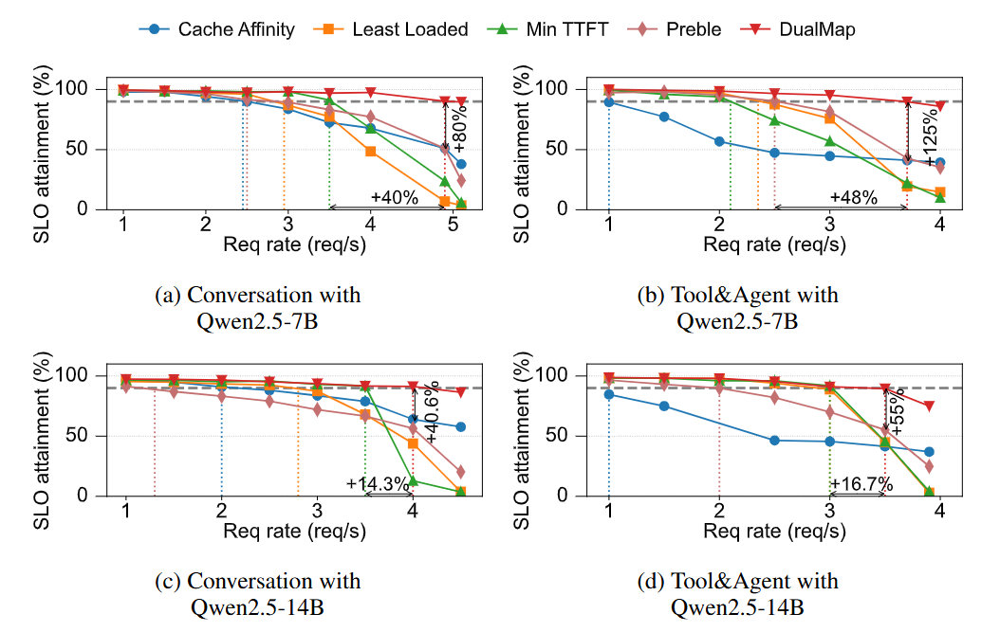

# DualMap

DualMap is a dual-mapping scheduling strategy designed for distributed large language model (LLM) serving, aiming to achieve both cache affinity and load balancing. By employing a dual-hash mapping mechanism based on request prompts, DualMap generates two candidate instances for each request and intelligently selects the optimal one according to the current system state. This design enhances the co-location probability of requests sharing the same prefix while achieving global load balance through the **power of two choices.**  Building on this foundation, DualMap further incorporates SLO-aware routing, hotspot-aware rebalancing to ensure efficient cache reuse and balanced load distribution under dynamic and skewed workloads. These designs significantly enhance the effective request capacity of system and reduce the per-request inference cost.

## Prerequisites

- **Hardware**: ≥ 8 GPUs (for full-scale experiments), DRAM ≥ 512GB
- **Software**: Python 3.10+, PyTorch2.3.0+, vLLM >=0.4.2, HuggingFace `transformers`

## Installation

```bash
conda create -n dualmap python=3.10 -y
conda activate dualmap
cd DualMap
pip install -r ./requirements.txt
```


## Getting Start

### 1. Dataset Preprocessing

Process the [Mooncake](https://github.com/kvcache-ai/Mooncake/tree/main/FAST25-release/traces) open-source dataset:

```bash
# Qwen2.5-7B-Instruct for mooncake date set
# toolagent
python evaluation/run/process_dataset.py --model_path ./models/Qwen/Qwen2.5-7B-Instruct --origin_dataset_file ./evaluation/dataset/toolagent_trace.jsonl --processed_dataset_file ./evaluation/dataset/mooncake/processed_toolagent_trace.jsonl
# conversation 
python evaluation/run/process_dataset.py --model_path ./models/Qwen/Qwen2.5-7B-Instruct --origin_dataset_file ./evaluation/dataset/conversation_trace.jsonl --processed_dataset_file ./evaluation/dataset/mooncake/processed_conversation_trace.jsonl
```

replace  `./models/Qwen/Qwen2.5-7B-Instruct` with your own model path

 Processed data saved to `./evaluation/dataset/mooncake/processed_toolagent_trace.jsonl` and `./evaluation/dataset/mooncake/processed_conversation_trace.jsonl`

### 2. Launch Inference Instances (via vLLM)

vllm>=0.4.2

Start replicas of the Qwen/Qwen2.5-7B-Instruct model (example for 8 ports):

```bash
# Start replica 1 (port 8081)
python -u -m vllm.entrypoints.openai.api_server \
    --model ./models/Qwen/Qwen2.5-7B-Instruct \  # local model path
    --max-num-seqs=256 \
	--max-model-len=20480 \
    --max-num-batched-tokens=20480 \
	--dtype=float16 \
    --tensor-parallel-size=1 \
	--block-size=128 \
    --host=0.0.0.0 \
    --port=8081 \
    --gpu-memory-utilization=0.9 \
    --trust-remote-code \
    --served-model-name "Qwen2.5-7B-Instruct"
```

Repeat the above command for ports **8082–8088** (each bound to a different GPU) to launch the remaining inference instances.

> **Note:** In our experiments, we extend **vLLM** with **DRAM-based KV-cache management**. **LMCache** or  **Mooncake** can serve as a *drop-in replacement* for this DRAM-based KV-cache management module. Each inference instance is allocated 64 GB of DRAM for KV-cache management.

### 3. Run Experiments

```python
python ./start_up.py \
--replicas_ip_port "127.0.0.1:8081,127.0.0.1:8082,127.0.0.1:8083,127.0.0.1:8084,127.0.0.1:8085,127.0.0.1:8086,127.0.0.1:8087,127.0.0.1:8088" \
--model_path "./models/Qwen/Qwen2.5-7B-Instruct" \
--model_name "Qwen2.5-7B-Instruct" \
--max_model_len 20480 \
--block_size 128 \
--kv_cache_size_per_token 57344 \
--replica_dram_size 64 \
--qps 10 \
--prefill_tpot 0.00016 \
--tpct 0.00016 \
--tprt 0.0 \
--global_scheduler_type "cache_affinity" \
--ttft_slo 5 \
--request_num 8000 \
--dataset_file "./evaluation/dataset/mooncake/processed_toolagent_trace.jsonl" \
--dataset_type "toolagent"
```


#### Parameter Descriptions

| Parameter                   | Description                                                  |
| --------------------------- | ------------------------------------------------------------ |
| **replicas_ip_port**        | IP and port list of inference instances launched in step 2, separated by commas. |
| **model_path**              | The local model path, consistent with `model` in step 2.     |
| **model_name**              | Same as `served-model-name` in step 2.                       |
| **max_model_len**           | Maximum model length, consistent with `--max-model-len` in step 2. |
| **block_size**              | Same as `--block-size` in step 2.                            |
| **kv_cache_size_per_token** | The KV-cache size per token, determined by model and dtype. For example, `Qwen2.5-7B-Instruct` with `float16` → 57344. |
| **replica_dram_size**       | The amount of DRAM (in GB) allocated per replica for KV-cache management. |
| **qps**                     | Query-per-second (QPS) rates at which the client sends requests to the global scheduler. |
| **prefill_tpot**            | The average processing time per token (in seconds) during the prefill phase on a single inference instance under interference-free conditions. |
| **tpct**                    | Time per compute token for TTFT estimation. Defaults to `prefill_tpot` when omitted. |
| **tprt**                    | Time per read token for KV-cache transfer in TTFT estimation. |
| **local_hit_tprt**          | Time per token for local KV reuse in TTFT estimation. |
| **remote_hit_tprt**         | Time per token for cross-instance KV reuse in TTFT estimation. Defaults to `tprt` when omitted. |
| **force_output_len_1**      | Force `output_len/max_tokens=1` for each request (prefill-focused runs with minimal decode). |
| **global_scheduler_type**   | Types of global schedulers to be compared (e.g., `"cache_affinity, min_pending_input, min_ttft, preble,dualmap"`). |
| **ttft_slo**                | Seconds                                                      |
| **request_num**             | Number of requests which the client sends to the global scheduler. |
| **dataset_type**            | Type of dataset: `toolagent` or `conversation`.              |
| **dataset_file**            | Dataset file: processed data file in `step 1. Dataset Preprocessing` |

Experiment outputs will be saved in the directory:`./evaluation/result/data/*`

> Note: Restart all inference instances for another experiment set to ensure environmental consistency.

## Shared KV Cache Reuse Semantics (local / cross-instance / miss)

DualMap supports a shared-pool reuse model (within this repo's current single-process/shared-memory execution model):

- **local reuse**: KV blocks already located on the selected replica.
- **cross-instance reuse**: KV blocks generated by another replica but reusable through the shared pool.
- **miss**: KV blocks not found in shared pool and therefore requiring prefill/recompute.

### Related runtime flags and TTFT coefficients

- `enable_shared_kv_pool`: enable shared KV namespace across replicas.
  - `False`: legacy behavior (per-replica local cache only).
  - `True`: scheduler/admission can use both local and cross-instance reusable tokens.
- `tpct`: per-token cost for **miss/recompute** in TTFT estimation.
- `local_hit_tprt`: per-token cost for **local reuse** in TTFT estimation.
- `remote_hit_tprt` (falls back to `tprt` if omitted): per-token cost for **cross-instance reuse** in TTFT estimation.

### Execution-side token accounting

When shared pool is enabled:

- `actual_num_prefill_tokens` only counts **miss tokens**.
- Cross-instance reusable tokens are excluded from full recompute and charged by `remote_hit_tprt` in TTFT/scheduler cost.
- Local reusable tokens are charged by `local_hit_tprt`.

### How to verify it works

```bash
PYTHONPATH=. pytest -q tests/test_shared_kv_pool.py
```

The test suite verifies:
- cross-instance reuse affecting request admission token accounting,
- TTFT/scheduler local-vs-cross cost distinction,
- compatibility fallback when `enable_shared_kv_pool=False`.

## Priority labeling and KV transfer propagation

DualMap now supports request-level priority labeling for KV transfer hints.

### What is labeled

- Each request is labeled as `HIGH` or `LOW` priority by scheduler-side `predicted_ttft`.
- Labeling supports:
  - `priority_policy=quantile` (default)
  - `priority_policy=threshold`

### Policy defaults

- `priority_enabled=true`
- `priority_policy=quantile`
- `priority_quantile=0.99` (P99)
- `priority_window_size=256`

### Historical baseline used by quantile policy

- Quantile window uses **observed completed TTFT** only.
- Current request classification still uses **predicted TTFT**.

### KV transfer request propagation

When sending inference requests, DualMap writes the label into existing `kv_transfer_params`:

```json
{
  "model": "...",
  "messages": [...],
  "max_tokens": 128,
  "kv_transfer_params": {
    "prefix_kv_load_priority": "high"
  }
}
```

`HIGH -> "high"`, `LOW -> "low"`.

### Migration (rebalance) behavior

- If a waiting request is migrated to another replica, scheduler recomputes predicted TTFT on target replica and relabels before dispatch.
- The final dispatched request carries the updated `prefix_kv_load_priority`.

### Metrics columns (request_metrics.csv)

The following columns are recorded for analysis/replay:

- `priority_enabled`
- `priority_policy`
- `priority_level`
- `priority_predicted_ttft`
- `priority_threshold`
- `priority_quantile`
- `priority_window_size`

### Suggested verification commands

```bash
PYTHONPATH=. pytest -q tests/test_shared_kv_pool.py
```

Optional checks for generated metrics:

```bash
head -n 1 ./evaluation/result/data/*/request_metrics.csv
```

For more maintainer-oriented details, see:
`docs/shared_kv_cache_usage.md`

## Evaluations

### Process Results

```python
python evaluation/plots/dataset_performance/goodput_and_effective_req_capacity.py \
--model_name "Qwen2.5-7B-Instruct" \
--replica_dram_size 64 \
--qps_list "1,2,3,4,5" \
--dataset_type "toolagent" \
--global_scheduler_type_list "cache_affinity,min_pending_input,min_ttft,preble,dualmap" \
--replica_num 8 \
--request_num 8000 \
--ttft_slo 5
```

Processed experiment data and pics will be saved in the directory:`./evaluation/result/processed_data/*`

#### Parameter Descriptions

`model_name,replica_dram_size,qps_list,dataset_type,global_scheduler_type_list,request_num,ttft_slo` are same as  `3. Run Experiments`, `replica_num` is the number of instances in `2. Launch Inference Instances `

### Results

We list some of the primary evaluation results.  All experiments are conducted on a distributed LLM serving cluster. Each node in the cluster is equipped with 8 Ascend NPUs (910B4: 32 GB HBM or 910B3: 64 GB HBM) and each instance is  equipped with 64GB DRAM for KV cache manager. We evaluate Qwen2.5 7B and 14B models using default float16 precision. Each instance is assigned a dedicated NPU (910B4 for 7B, 910B3 for 14B). DualMap boosts effective request capacity by up to 2.25$\times$ under the same TTFT SLO constraints, compared with the state-of-the-art work.


**Effective request capacity and goodput of different scheduling strategies**



## Citation

If you use DualMap in your research, please cite our paper:

```bibtex
@inproceedings{yuan2026dualmap,
  title={DualMap: Enabling Both Cache Affinity and Load Balancing for Distributed LLM Serving},
  author={Yuan, Ying and Zuo, Pengfei and Wang, Bo and Chen, Zhangyu and Tan, Zhipeng and Yu, Zhou},
  booktitle={Proceedings of the 14th International Conference on Learning Representations (ICLR)},
  year={2026}
}
```

## 中文使用说明（简要）

### 功能开关

- `enable_shared_kv_pool=True`：启用共享 KV 池语义，支持跨实例复用。
- `enable_shared_kv_pool=False`：保持旧行为（每个实例本地缓存，不做跨实例复用）。

### 三类 token 语义

- **local reuse**：当前副本本地已有 KV，按 `local_hit_tprt` 计入 TTFT。
- **cross-instance reuse**：其他副本已有 KV、当前副本可从共享池复用，按 `remote_hit_tprt`（未设置时回退 `tprt`）计入 TTFT。
- **miss**：共享池中不存在可复用 KV，按 `tpct` 计入 TTFT，并进入 prefill/recompute。

### 执行侧关键点

- 开启共享池后，`actual_num_prefill_tokens` 只统计 miss tokens。
- local/cross-instance 可复用 tokens 不再按 full recompute 计算。

### 快速验证

```bash
PYTHONPATH=. pytest -q tests/test_shared_kv_pool.py
```
